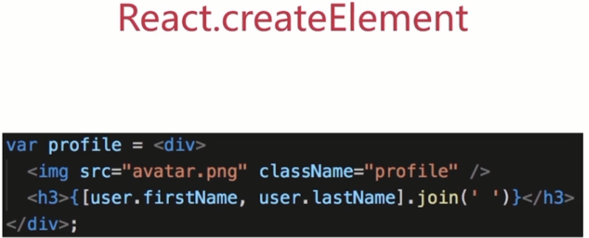
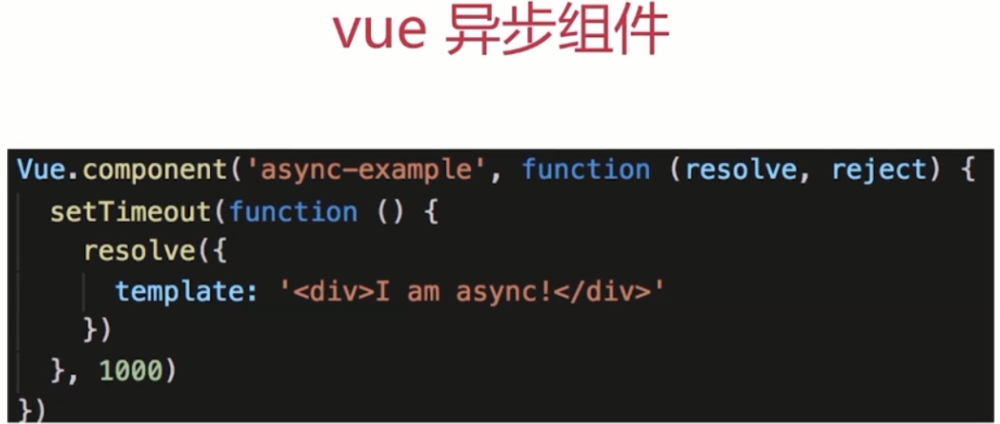

# JS设计模式开发实践分享

## 现代前端交互框架

1. 直接DOM操作时代

    代表：jQuery、prototype、motools等

后两者一开始就实现了类的设计模式而且API的使用不太方便，相反jQuery以其简单友好的API和书写方式得到了广大开发者的认可

jQuery主要实现了选择器、DOM操作方法、事件绑定封装、AJAX、Deferred这个五个方面的封装和常见的兼容性问题的处理。除此之外，我们还可以基于jQuery扩展更多的方法功能来提高业务开发效率。

SPA

2. MV*交互模式

* 前端MVC模式（Model-View-Controller）

    成熟的MVC框架一般是通过事件监听或观察者模式来实现的。
    实现：Backbone.js

* 前端MVP模式（Model-View-Presenter）

* 前端MVVM模式（Model-View-ViewModel）

    可以认为是自动化的MVP框架

    * 数据变更检测示例

        1. 手动触发绑定

            监听dom事件

        2. 脏检测机制

            原理：在ViewModel对象的某个属性值发生变化时找到与这个属性相关的所有元素，然后再比较数据变化，如果变化则进行Directive指令调用，对这个元素进行重新扫描渲染。

        3. 前端数据对象劫持

            使用Object.defineProperty 和 Object.definePropertys 对ViewModel数据对象进行属性get()和set()监听

        4. ES6 Proxy


前端框架从直接操作DOM到MVC设计模式，MVP，MVVM，前端设计模式的改进原则一直向着高效、易维护、易扩展的基本方向发展

3. Virtual DOM交互模式

4. 前端MNV*时代

    react-native（基于react - facebook）
    weex（基于vue - alibaba）

## 类库或框架中的设计模式介绍

1. jQuery迭代器

```javascript
$.each = function( obj, callback ) {
    var value,
        i = 0,
        length = obj.length,
        isArray = isArraylike( obj );
    if ( isArray ) { // 迭代类数组
        for ( ; i < length; i++ ) {
            value = callback.call( obj[ i ], i, obj[ i ] );
            if ( value === false ) {
                break;
            }
        }
    } else {
        for ( i in obj ) { // 迭代 object 对象
            value = callback.call( obj[ i ], i, obj[ i ] );
            if ( value === false ) {
                break;
            }
        }
    }
    return obj;
};
```

## 设计模式

1. 设计原则

    S(单一职责原则)
    O(开放-封闭原则)
    L(Liskov（里氏）替换原则)
    I(接口隔离原则)
    D(依赖倒转原则)

    * 单一职责原则
        
        单一职责原则原则就是每个程序只负责做好一件事情，如果功能过于复杂就拆分开，每个部分保持独立。
        ~比如组件化

    * 开放封闭原则

        开发封闭原则大白话的意思就是对扩展开放，对修改封闭。
        ~举个简单的实际开发中的例子

    * 里氏替换原则

        子类型必须能够替换掉它们的父类型。简单地说，这是因为子类型继承了父类，所以子类可以以父类的身份出现。
        （JS中使用较少）

    * 接口隔离原则

        使用多个专门的接口比使用单一的总接口要好。
        一个类对另外一个类的依赖性应当是建立在最小的接口上的。
        一个接口代表一个角色，不应当将不同的角色都交给一个接口。没有关系的接口合并在一起，形成一个臃肿的大接口，这是对角色和接口的污染。
        （JS中使用较少）

    * 依赖倒转原则

        抽象不应该依赖细节，细节应该依赖于抽象。简单说就是，我们要针对接口编程，而不要针对实现编程。
        （JS中使用较少）

```javascript
// Promise说明S O
const loadImage = function (src) {
    const promise = new Promise(function(resolve, reject){
        const img = document.createElement('img')
        img.onload = function(){
            resolve(img)
        }
        img.onerror = function(){
            reject('图片加载失败')
        }
        img.src = src
    })
    return promise
}
const src = 'http://pic15.nipic.com/20110628/1369025_192645024000_2.jpg'
const result = loadImage(src)
result
    .then(function(img){
        console.log('imgWidth: ' + img.width)
        return img
    })
    .then(function(img){
        console.log('imgHeight: ' + img.height)
    })
    .catch(function(error){
        console.log(error)
    })
```

2. 设计模式

    * 创建型

    |英文名称|中文名称|介绍|
    |:---:|:---|:---:|
    | Factory |工厂模式| 包含工厂方法、抽象工厂、建造模式 |
    | Singleton |单例模式|保证一个类只有一个实例，并提供一个访问它的全局访问点（例如jQuery里的$，vuex里的store，window对象等）|
    | Prototype |原型模式|用原型实例指定创建对象的种类，并且通过拷贝这些原型来创建新的对象。|

    * 结构型

    |英文名称|中文名称|介绍|
    |:---:|:---|:---:|
    | Adapter | 适配器模式 | 将一类的接口转换成客户希望的另外一个接口，Adapter模式使得原本由于接口不兼容而不能一起工作那些类可以一起工作 |
    | Decrator | 装饰模式 | 动态地给一个对象增加一些额外的职责，就增加的功能来说，Decorator模式相比生成子类更加灵活 |
    | Proxy | 代理模式 | 为其他对象提供一种代理以控制对这个对象的访问 |
    | Facade | 外观模式 | 为子系统中的一组接口提供一致的界面，fa?ade提供了一高层接口，这个接口使得子系统更容易使用 |
    | Bridge | 桥接模式 | 将抽象部分与它的实现部分相分离，使他们可以独立的变化。 |
    | Composite | 组合模式 | 将对象组合成树形结构以表示部分整体的关系，Composite使得用户对单个对象和组合对象的使用具有一致性 |
    | Flyweight | 享元模式 | 一种用于性能优化的模式，“fly”在这里是苍蝇的意思，意为蝇量级。享元模式的核心是运用共享技术来有效支持大量细粒度的对象 |

    * 行为型

    |英文名称|中文名称|介绍|
    |:---:|:---|:---:|
    | Observer | 观察者模式 | 定义对象间一对多的依赖关系，当一个对象的状态发生改变时，所有依赖于它的对象都得到通知自动更新 |
    | Iterator | 迭代器模式 | 提供一个方法顺序访问一个聚合对象的各个元素，而又不需要暴露该对象的内部表示 |
    | State | 状态模式 | 允许对象在其内部状态改变时改变他的行为。对象看起来似乎改变了他的类 |
    | Template Method | 模板方法 | 定义一个操作中的算法的骨架，而将一些步骤延迟到子类中，TemplateMethod使得子类可以不改变一个算法的结构即可以重定义该算法得某些特定步骤。 |
    | Command | 命令模式 | 将一个请求封装为一个对象，从而使你可以用不同的请求对客户进行参数化，对请求排队和记录请求日志，以及支持可撤销的操作。 |
    | Strategy | 策略模式 | 定义一系列的算法，把他们一个个封装起来，并使他们可以互相替换，本模式使得算法可以独立于使用它们的客户 |
    | Chain of Responsibility | 职责链模式 | 使多个对象都有机会处理请求，从而避免请求的送发者和接收者之间的耦合关系 |
    | Mediator | 中介者模式 | 用一个中介对象封装一些列的对象交互 |
    | Visitor | 访问者模式 | 表示一个作用于某对象结构中的各元素的操作，它使你可以在不改变各元素类的前提下定义作用于这个元素的新操作。 |
    | Interpreter | 解释器模式 | 给定一个语言，定义他的文法的一个表示，并定义一个解释器，这个解释器使用该表示来解释语言中的句子。 |
    | Memento | 备忘录模式 | 在不破坏对象的前提下，捕获一个对象的内部状态，并在该对象之外保存这个状态。 |

## 具体设计模式详细介绍

    介绍和举例
    结合经典应用场景，讲解该设计模式如何被使用

1. 工厂模式

    * 介绍
    将new单独封装
    遇到new时，就可以考虑是否使用该模式
    * 示例
    你去肯德基买汉堡，直接点餐、取餐，不会自己亲手做
    商店“封装”好做汉堡的工作，做好直接给买者
    * 场景
        1. jQuery - $('div')

            $('div')和new $('div')有撒区别
            一、书写麻烦，jQuery链式操作成为噩梦
            二、一旦jQuery（构造函数）名字变化，将是灾难性的
        
        2. React.createElement
        JSX语法：
        
        JSX编译后：
        
        源码：
        
        3. vue异步组件
        
    * 设计原则验证
        构造函数和创造者分离
        符合开放封闭原则

2. 观察者模式

    * 介绍
    发布 & 订阅
    一对多
    * 示例
    点咖啡，点好之后坐等服务员叫号
    * UML类图和演示
    
    ```javascript
    // 主题，保存状态，状态变化之后触发所有观察者对象
    class Subject{
        constructor(){
            this.state = 0
            this.observers = []
        }
        getState(){
            return this.state
        }
        setState(state){
            this.state = state
            this.notifyAllObservers()
        }
        notifyAllObservers(){
            this.observers.forEach(function(observer){
                observer.update()
            })
        }
        attach(observer){
            this.observers.push(observer)
        }
    }
    // 观察者
    class Observer{
        constructor(name, subject){
            this.name = name
            this.subject = subject
            this.subject.attach(this)
        }
        update(){
            console.log(`观察者-${this.name}监听到主题状态有变化-${this.subject.getState()}`)
        }
    }
    // 测试
    const subject = new Subject()
    const observer1 = new Observer('1', subject)
    const observer2 = new Observer('2', subject)
    subject.setState(2)
    ```
    * 场景
    网页事件绑定
    
    Promise
    vue和React组件生命周期触发
    vue父子组件通信
    vue watch
    * 设计原则验证
    主题和观察者分离，不是主动触发而是被动监听，两者解耦
    符合开放封闭原则
    * 优缺点
    ```
    优点：发布—订阅模式的优点非常明显，一为时间上的解耦，二为对象之间的解耦。
    它的应用非常广泛，既可以用在异步编程中，也可以帮助我们完成更松耦合的代码编写。
    发布—订阅模式还可以用来帮助实现一些别的设计模式，比如中介者模式。 
    从架构上来看，无论是 MVC 还是 MVVM，都少不了发布—订阅模式的参与，
    而且 JavaScript 本身也是一门基于事件驱动的语言。

    缺点：创建订阅者本身要消耗一定的时间和内存，而且当你订阅一个消息后，
    也许此消息最后都未发生，但这个订阅者会始终存在于内存中。另外，
    发布—订阅模式虽然可以弱化对象之间的联系，但如果过度使用的话，
    对象和对象之间的必要联系也将被深埋在背后，会导致程序难以跟踪维护和理解。
    特别是有多个发布者和订阅者嵌套到一起的时候，要跟踪一个 bug 不是件轻松的事情
    ```

3. 迭代器模式

    * 内部迭代器与外部迭代器

    ```javascript
    // 内部迭代器 - 内部已经定义好了迭代规则，它完全接手整个迭代过程，外部只需要一次初始调用
    // -- jQuery迭代函数each
    // 外部迭代器 - 外部迭代器必须显式地请求迭代下一个元素
    var Iterator = function( obj ){
        var current = 0;
            var next = function(){
            current += 1;
        };
        var isDone = function(){
            return current >= obj.length;
        };
        var getCurrItem = function(){
            return obj[ current ];
        };
        return {
            next: next,
            isDone: isDone,
            getCurrItem: getCurrItem
        }
    };
    ```

## 自由讨论

该怎么学习设计模式

    明白每个设计的道理和用意
    通过经典应用体会它的真正使用场景
    编码时多思考，尽量模仿

聊一聊阅读经典lib源码的意义

    学习如何实现功能
    学习它的设计思路
    强制自己写代码时模拟

技术分享的的主题以及其他

* uncurrying (提取泛化 this 的过程)
```javascript
//  JavaScript 之父 Brendan Eich 在 2011 年发表的一篇 Twitter，下面列出的是一个实现方式
Function.prototype.uncurrying = function () {
    var self = this;
    return function() {
        var obj = Array.prototype.shift.call( arguments );
        return self.apply( obj, arguments );
    };
};
// 示例
const push = Array.prototype.push.uncurrying();
(function(){
    push( arguments, 4 );
    console.log( arguments ); // 输出： [1, 2, 3, 4]
})( 1, 2, 3 );
```
## 资源分享

1. [MVC，MVP 和 MVVM 的图示](http://www.ruanyifeng.com/blog/2015/02/mvcmvp_mvvm.html)

## 思考题
* 某打车平台面试题
    题：
    打车时，可以打专车和快车。任何车都有车牌号和名称
    不同车价格不同，快车每公里1元，专车每公里2元
    行程开始时，显示车辆信息
    行程结束时，显示打车金额（假定行程就五公里）
    问：
    画出UML类图
    用ES6语法写出该示例

```javascript
// 父类 - 车
class Car {
    constructor(carNumber, carName){
        this.carNumber = carNumber
        this.carName = carName
    }
    getCarInfo(){
        console.log('车牌号： ' + this.carNumber)
        console.log('车名: ' + this.carName)
    }
}

// 子类 - 专车
class SpecialCar extends Car {
    constructor(arNumber, carName){
        super(arNumber, carName)
        this.unitPrice = 1
    }
}
// 子类 - 快车
class QuickCar extends Car {
    constructor(arNumber, carName){
        super(arNumber, carName)
        this.unitPrice = 2
    }
}
// 行程
class Trip {
    constructor(car){
        this.status = 'start' // start inProgress end
        this.car = car // 车实例
        this.distance = 0
    }
    start(){
        this.status = 'inProgress'
        this.car.getCarInfo()
    }
    updateStatus(status){
        this.status = status
    }
    updateDistance(distance){
        this.distance = distance
    }
    end(){
        this.status = 'end'
        console.log('本次行车打车金额为： ' + this.getFare() + '元 \n')
        console.log('感谢您的乘坐，祝你生活愉快')
    }
    getFare(){
        return this.distance * this.car.unitPrice
    }
}
// 实例 - test
const car = new QuickCar('110','捷达')
const trip = new Trip(car)
trip.start()
trip.updateDistance(5)
trip.end()
```