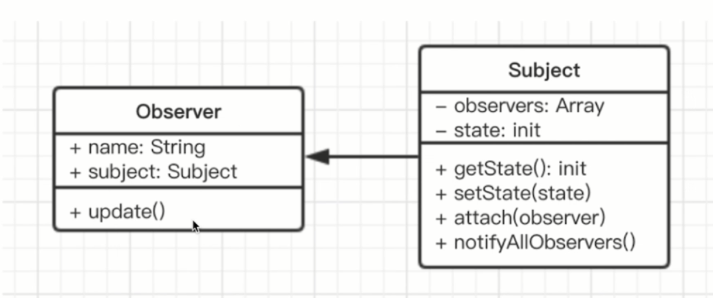

# 设计模式详解

    介绍和举例
    结合经典应用场景，讲解该设计模式如何被使用

## 工厂模式

* 介绍
    ```
    将new单独封装
    遇到new时，就可以考虑是否使用该模式
    ```
* 示例
    ```
    你去肯德基买汉堡，直接点餐、取餐，不会自己亲手做
    商店“封装”好做汉堡的工作，做好直接给买者
    ```
* 场景
    
    1. jQuery - $('div')
        ``` 
        $('div')和new $('div')有撒区别
        一、书写麻烦，jQuery链式操作成为噩梦
        二、一旦jQuery（构造函数）名字变化，将是灾难性的
        ```

    
    2. React.createElement
    JSX语法：
    
    JSX编译后：
    
    源码：
    
    3. vue异步组件
    
* 设计原则验证
    ```
    构造函数和创造者分离
    符合开放封闭原则
    ```

## 观察者模式

* 介绍
    ```
    发布 & 订阅
    一对多
    ```
* 示例
    ```
    点咖啡，点好之后坐等服务员叫号
    ```
* UML类图和演示

```javascript
// 主题，保存状态，状态变化之后触发所有观察者对象
class Subject{
    constructor(){
        this.state = 0
        this.observers = []
    }
    getState(){
        return this.state
    }
    setState(state){
        this.state = state
        this.notifyAllObservers()
    }
    notifyAllObservers(){
        this.observers.forEach(function(observer){
            observer.update()
        })
    }
    attach(observer){
        this.observers.push(observer)
    }
}
// 观察者
class Observer{
    constructor(name, subject){
        this.name = name
        this.subject = subject
        this.subject.attach(this)
    }
    update(){
        console.log(`观察者-${this.name}监听到主题状态有变化-${this.subject.getState()}`)
    }
}
// 测试
const subject = new Subject()
const observer1 = new Observer('1', subject)
const observer2 = new Observer('2', subject)
subject.setState(2)
```
* 场景

```
网页事件绑定
```

```
Promise
vue和React组件生命周期触发
vue父子组件通信
vue watch
```
* 设计原则验证
```
主题和观察者分离，不是主动触发而是被动监听，两者解耦
符合开放封闭原则
```
* 优缺点
```
优点：发布—订阅模式的优点非常明显，一为时间上的解耦，二为对象之间的解耦。
它的应用非常广泛，既可以用在异步编程中，也可以帮助我们完成更松耦合的代码编写。
发布—订阅模式还可以用来帮助实现一些别的设计模式，比如中介者模式。 
从架构上来看，无论是 MVC 还是 MVVM，都少不了发布—订阅模式的参与，
而且 JavaScript 本身也是一门基于事件驱动的语言。

缺点：创建订阅者本身要消耗一定的时间和内存，而且当你订阅一个消息后，
也许此消息最后都未发生，但这个订阅者会始终存在于内存中。另外，
发布—订阅模式虽然可以弱化对象之间的联系，但如果过度使用的话，
对象和对象之间的必要联系也将被深埋在背后，会导致程序难以跟踪维护和理解。
特别是有多个发布者和订阅者嵌套到一起的时候，要跟踪一个 bug 不是件轻松的事情
```

## 单例模式

* 介绍
```
系统中被唯一使用
一个类只有一个实例
```
* 示例
```
登录框
购物车
```
* 演示
```javascript
// 面向对象方式
class SingleWM{
    login(){
        console.log('login')
    }
}
SingleWM.getInstance = (function(){
    let instance
    return function(){
        if(!instance){
            instance = new SingleWM()
        }
        return instance
    }
})()
// test
const login1 = SingleWM.getInstance()
login1.login()
const login2 = SingleWM.getInstance()
login2.login()
console.log(login1 === login2)

// 通用的惰性单例模式 - 函数方式
const getSingle = function(fn){
    let result
    return function(){
        return result || (result = fn.apply(this, arguments))
    }
}
const createLogin = getSingle(function(){
    console.log('createLogin')
    const login = document.createElement('div')
    login.setAttribute('class', 'login')
    return login
})
const renderLogin = function(){
    console.log('开始输出登录框')
    console.log(createLogin())
}
renderLogin()
renderLogin()
renderLogin()
```
* 场景
    jQuery只有一个$
    

* 其他
```
购物车
vuex和redux中的store
```

## 迭代器模式

* 内部迭代器与外部迭代器

```javascript
// 内部迭代器 - 内部已经定义好了迭代规则，它完全接手整个迭代过程，外部只需要一次初始调用
// -- jQuery迭代函数each
$.each = function( obj, callback ) {
    var value,
        i = 0,
        length = obj.length,
        isArray = isArraylike( obj );
    if ( isArray ) { // 迭代类数组
        for ( ; i < length; i++ ) {
            value = callback.call( obj[ i ], i, obj[ i ] );
            if ( value === false ) {
                break;
            }
        }
    } else {
        for ( i in obj ) { // 迭代 object 对象
            value = callback.call( obj[ i ], i, obj[ i ] );
            if ( value === false ) {
                break;
            }
        }
    }
    return obj;
};
// 外部迭代器 - 外部迭代器必须显式地请求迭代下一个元素
const Iterator = function( obj ){
    let current = 0;
    const next = function(){
        current += 1;
    };
    const isDone = function(){
        return current >= obj.length;
    };
    const getCurrItem = function(){
        return obj[ current ];
    };
    return {
        next: next,
        isDone: isDone,
        getCurrItem: getCurrItem
    }
}

// 判断两个数组里元素的值是否相等
// 内部
const compare = function( ary1, ary2 ){
    if ( ary1.length !== ary2.length ){
        throw new Error ( 'ary1 和 ary2 不相等' )
    }
    ary1.forEach( function( i, n ){
        if ( n !== ary2[ i ] ){
            throw new Error ( 'ary1 和 ary2 不相等' )
        }
    })
    alert ( 'ary1 和 ary2 相等' )
}
// 外部
const compare = function( iterator1, iterator2 ){
    while( !iterator1.isDone() && !iterator2.isDone() ){
        if ( iterator1.getCurrItem() !== iterator2.getCurrItem() ){
            throw new Error ( 'iterator1 和 iterator2 不相等' );
        }
        iterator1.next()
        iterator2.next()
    }
    alert ( 'iterator1 和 iterator2 相等' )
}
const iterator1 = Iterator( [ 1, 2, 3 ] )
const iterator2 = Iterator( [ 1, 2, 3 ] )
compare(iterator1,iterator2)
```

## 装饰模式

* 介绍
```
为对象添加新功能
不改变其原有的结构和功能
```
* 示例
```
手机壳
```
* 演示


```javascript
// 实现一
class Circle {
    draw() {
        console.log('画一个圆')
    }
}
class Decorator {
    constructor(circle){
        this.circle = circle
    }
    draw() {
        this.circle.draw()
        this.setRedBorder(circle)
    }
    setRedBorder() {
        console.log('设置红色边框')
    }
}

// 测试代码
let circle = new Circle()
circle.draw()

let decorator = new Decorator(circle)
decorator.draw()

// 实现二
// AOP - 面向切面编程，通过预编译方式和运行期动态代理实现程序功能的统一维护的一种技术。
Function.prototype.before = function(fn){
    const _self = this
    return function(){
        fn.apply(this, arguments)
        return _self.call(this, arguments)
    }
}
// test
const _submit = function(){
    console.log('form submit')
}
const submit = _submit.before(function(){
    console.log('validate')
})
submit()

// 不污染原型方式
const before = function(fn, beforeFn){
    return function(){
        beforeFn.apply(this,arguments)
        return fn.apply(this,arguments)
    }
}
// test
const _submit = function(){
    console.log('form submit')
}
const submit = before(_submit, function(){
    console.log('validate')
})
submit()

// 
```
* 场景
```
插件式表单校验
网站UV/PV统计
日志上报
```