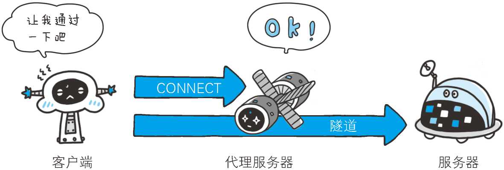
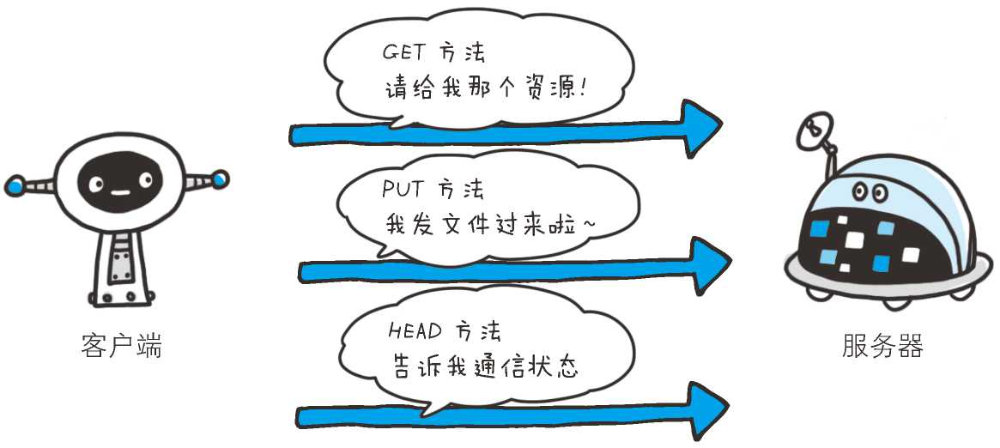

#   HTTP协议相关分享

*分享目的：*
    
    了解 Web 是建立在何种技术之上，以及 HTTP协议是如何诞生并发展的。
    了解 HTTP请求报文和响应报文基本结构
    了解 HTTP方法
    了解 HTTP状态码

##  Web 及网络基础

### HTTP的诞生

1. **为知识共享而规划 Web**


&emsp;&emsp;1989 年 3 月，互联网还只属于少数人。在这一互联网的黎明期，HTTP 诞生了。


&emsp;&emsp;CERN（欧洲核子研究组织）的蒂姆 • 伯纳斯 - 李（Tim BernersLee）博士提出了一种能让远隔两地的研究者们共享知识的设想。

&emsp;&emsp;最初设想的基本理念是：借助多文档之间相互关联形成的超文本（HyperText），连成可相互参阅的 WWW（World Wide Web，万维网）。

&emsp;&emsp;现在已提出了 3 项 WWW 构建技术，分别是：把 SGML（Standard Generalized Markup Language，标准通用标记语言）作为页面的文本标记语言的 HTML（HyperText Markup Language，超文本标记语言）；作为文档传递协议的 HTTP（HTTP，HyperText Transfer Protocol，超文本传输协议） ；指定文档所在地址的 URL（Uniform Resource Locator，统一资源定位符）。

&emsp;&emsp;WWW 这一名称，是 Web 浏览器当年用来浏览超文本的客户端应用程序时的名称。现在则用来表示这一系列的集合，也可简称为 Web。

2. **Web 成长时代**

&emsp;&emsp;1990 年 11 月，CERN 成功研发了世界上第一台 Web 服务器和 Web 浏览器。两年后的 1992 年 9 月，日本第一个网站的主页上线了。

> 日本第一个主页

    http://www.ibarakiken.gr.jp/www/
    
&emsp;&emsp;1990 年，大家针对 HTML 1.0 草案进行了讨论，因 HTML 1.0 中存在多处模糊不清的部分，草案被直接废弃了。 

> HTML1.0

    http://www.w3.org/MarkUp/draft-ietf-iiir-html-01.txt

&emsp;&emsp;1993 年 1 月，现代浏览器的祖先 NCSA（National Center for Supercomputer Applications，美国国家超级计算机应用中心）研发的 Mosaic 问世了。它以 in-line（内联）等形式显示 HTML 的图像，在图像方面出色的表现使它迅速在世界范围内流行开来。

&emsp;&emsp;同年秋天，Mosaic 的 Windows 版和 Macintosh 版面世。使用 CGI 技术的 NCSA Web 服务器、NCSA HTTPd 1.0 也差不多是在这个时期出现的。

> NCSA Mosaic bounce page

```
http://archive.ncsa.illinois.edu/mosaic.html
```

> The NCSA HTTPd Home Page（存档）

```
http://web.archive.org/web/20090426182129/http://hoohoo.ncsa.illinois.edu/（原址已失效）
```

&emsp;&emsp;1994 年 的 12 月，网景通信公司发布了 Netscape Navigator 1.0，1995 年微软公司发布 Internet Explorer 1.0 和 2.0。

&emsp;&emsp;紧随其后的是现在已然成为 Web 服务器标准之一的 Apache，当时它以 Apache 0.2 的姿态出现在世人眼前。而 HTML 也发布了 2.0 版本。那一年，Web 技术的发展突飞猛进。

&emsp;&emsp;时光流转，从 1995 年左右起，微软公司与网景通信公司之间爆发的浏览器大战愈演愈烈。两家公司都各自对 HTML 做了扩展，于是导致在写 HTML 页面时，必须考虑兼容他们两家公司的浏览器。时至今日，这个问题仍令那些写前端页面的工程师感到棘手。

&emsp;&emsp;在这场浏览器供应商之间的竞争中，他们不仅对当时发展中的各种 Web 标准化视而不见，还屡次出现新增功能没有对应说明文档的情况。

&emsp;&emsp;2000 年前后，这场浏览器战争随着网景通信公司的衰落而暂告一段落。但就在 2004 年，Mozilla 基金会发布了 Firefox 浏览器，第二次浏览器大战随即爆发。

&emsp;&emsp;Internet Explorer 浏览器的版本从 6 升到 7 前后花费了 5 年时间。之后接连不断地发布了 8、9、10 版本。另外，Chrome、Opera、Safari 等 浏览器也纷纷抢占市场份额。

3. **驻足不前的 HTTP**

> HTTP/0.9

&emsp;&emsp;HTTP 于 1990 年问世。那时的 HTTP 并没有作为正式的标准被建立。现在的 HTTP 其实含有 HTTP1.0 之前版本的意思，因此被称为 HTTP/0.9。

> HTTP/1.0

&emsp;&emsp;HTTP 正式作为标准被公布是在 1996 年的 5 月，版本被命名为 HTTP/1.0，并记载于 RFC1945。虽说是初期标准，但该协议标准至今仍被广泛使用在服务器端。

```
// RFC1945 - Hypertext Transfer Protocol -- HTTP/1.0
http://www.ietf.org/rfc/rfc1945.txt
```
> HTTP/1.1

&emsp;&emsp;1997 年 1 月公布的 HTTP/1.1 是目前主流的 HTTP 协议版本。当初的标准是 RFC2068，之后发布的修订版 RFC2616 就是当前的最新版本。

```
// RFC2616 - Hypertext Transfer Protocol -- HTTP/1.1
http://www.ietf.org/rfc/rfc2616.txt
```

&emsp;&emsp;可见，作为 Web 文档传输协议的 HTTP，它的版本几乎没有更新。新一代 HTTP/2.0 正在制订中，但要达到较高的使用覆盖率，仍需假以时日。

&emsp;&emsp;当年 HTTP 协议的出现主要是**为了解决文本传输的难题**。由于协议本身非常简单，于是在此基础上设想了很多应用方法并投入了实际使用。现在 HTTP 协议已经超出了 Web 这个框架的局限，被运用到了各种场景里。

### 网络基础 TCP/IP

&emsp;&emsp;为了理解 HTTP，我们有必要事先了解一下 TCP/IP 协议族。

&emsp;&emsp;通常使用的网络（包括互联网）是在 TCP/IP 协议族的基础上运作的。而 HTTP 属于它内部的一个子集。

&emsp;&emsp;我们仅介绍理解 HTTP 所需掌握的 TCP/IP 协议族的概要。

1. **TCP/IP 协议族**

&emsp;&emsp;计算机与网络设备要相互通信，双方就必须基于相同的方法。比如，如何探测到通信目标、由哪一边先发起通信、使用哪种语言进行通信、怎样结束通信等规则都需要事先确定。不同的硬件、操作系统之间的通信，所有的这一切都需要一种规则。而我们就把这种规则称为协议（protocol）。


*图：TCP/IP 是互联网相关的各类协议族的总称*

&emsp;&emsp;协议中存在各式各样的内容。从电缆的规格到 IP 地址的选定方法、寻找异地用户的方法、双方建立通信的顺序，以及 Web 页面显示需要处理的步骤，等等。

&emsp;&emsp;像这样把与互联网相关联的协议集合起来总称为 TCP/IP。也有说法认为，TCP/IP 是指 TCP 和 IP 这两种协议。还有一种说法认为，TCP/ IP 是在 IP 协议的通信过程中，使用到的协议族的统称。

2. **TCP/IP 的分层管理**

&emsp;&emsp;TCP/IP 协议族里重要的一点就是分层。TCP/IP 协议族按层次分别分为以下 4 层：应用层、传输层、网络层和数据链路层。

&emsp;&emsp;把 TCP/IP 层次化是有好处的。比如，如果互联网只由一个协议统筹，某个地方需要改变设计时，就必须把所有部分整体替换掉。而分层之后只需把变动的层替换掉即可。把各层之间的接口部分规划好之后，每个层次内部的设计就能够自由改动了。

&emsp;&emsp;值得一提的是，层次化之后，设计也变得相对简单了。处于应用层上的应用可以只考虑分派给自己的任务，而不需要弄清对方在地球上哪个地方、对方的传输路线是怎样的、是否能确保传输送达等问题。

TCP/IP 协议族各层的作用如下。

> 应用层

&emsp;&emsp;应用层决定了向用户提供应用服务时通信的活动。

&emsp;&emsp;TCP/IP 协议族内预存了各类通用的应用服务。比如，FTP（File Transfer Protocol，文件传输协议）和 DNS（Domain Name System，域名系统）服务就是其中两类。

HTTP 协议也处于该层。

> 传输层

&emsp;&emsp;传输层对上层应用层，提供处于网络连接中的两台计算机之间的数据传输。

&emsp;&emsp;在传输层有两个性质不同的协议：TCP（Transmission Control Protocol，传输控制协议）和 UDP（User Data Protocol，用户数据报协议）。

> 网络层（又名网络互连层）

&emsp;&emsp;网络层用来处理在网络上流动的数据包。数据包是网络传输的最小数据单位。该层规定了通过怎样的路径（所谓的传输路线）到达对方计算机，并把数据包传送给对方。

&emsp;&emsp;与对方计算机之间通过多台计算机或网络设备进行传输时，网络层所起的作用就是在众多的选项内选择一条传输路线。

> 链路层（又名数据链路层，网络接口层）

&emsp;&emsp;用来处理连接网络的硬件部分。包括控制操作系统、硬件的设备驱动、NIC（Network Interface Card，网络适配器，即网卡），及光纤等物理可见部分（还包括连接器等一切传输媒介）。硬件上的范畴均在链路层的作用范围之内。

3. **TCP/IP 通信传输流**


&emsp;&emsp;利用 TCP/IP 协议族进行网络通信时，会通过分层顺序与对方进行通信。发送端从应用层往下走，接收端则往应用层往上走。

&emsp;&emsp;我们用 HTTP 举例来说明，首先作为发送端的客户端在应用层（HTTP 协议）发出一个想看某个 Web 页面的 HTTP 请求。

&emsp;&emsp;接着，为了传输方便，在传输层（TCP 协议）把从应用层处收到的数据（HTTP 请求报文）进行分割，并在各个报文上打上标记序号及端口号后转发给网络层。

&emsp;&emsp;在网络层（IP 协议），增加作为通信目的地的 MAC 地址后转发给链路层。这样一来，发往网络的通信请求就准备齐全了。

&emsp;&emsp;接收端的服务器在链路层接收到数据，按序往上层发送，一直到应用层。当传输到应用层，才能算真正接收到由客户端发送过来的 HTTP 请求。


&emsp;&emsp;发送端在层与层之间传输数据时，每经过一层时必定会被打上一个该层所属的首部信息。反之，接收端在层与层传输数据时，每经过一层时会把对应的首部消去。

&emsp;&emsp;这种把数据信息包装起来的做法称为封装（encapsulate）。

### 与 HTTP 关系密切的协议 : IP、TCP 和 DNS

1. **负责传输的 IP 协议**

&emsp;&emsp;按层次分，IP（Internet Protocol）网际协议位于网络层。Internet Protocol 这个名称可能听起来有点夸张，但事实正是如此，因为几乎所有使用网络的系统都会用到 IP 协议。TCP/IP 协议族中的 IP 指的就是网际协议，协议名称中占据了一半位置，其重要性可见一斑。可能有人会把“IP”和“IP 地址”搞混，“IP”其实是一种协议的名称。

&emsp;&emsp;IP 协议的作用是把各种数据包传送给对方。而要保证确实传送到对方那里，则需要满足各类条件。其中两个重要的条件是 IP 地址和 MAC 地址（Media Access Control Address）。

&emsp;&emsp;IP 地址指明了节点被分配到的地址，MAC 地址是指网卡所属的固定地址。IP 地址可以和 MAC 地址进行配对。IP 地址可变换，但 MAC 地址基本上不会更改。

**使用 ARP 协议凭借 MAC 地址进行通信**

&emsp;&emsp;IP 间的通信依赖 MAC 地址。在网络上，通信的双方在同一局域网（LAN）内的情况是很少的，通常是经过多台计算机和网络设备中转才能连接到对方。而在进行中转时，会利用下一站中转设备的 MAC 地址来搜索下一个中转目标。这时，会采用 ARP 协议（Address Resolution Protocol）。ARP 是一种用以解析地址的协议，根据通信方的 IP 地址就可以反查出对应的 MAC 地址。

**没有人能够全面掌握互联网中的传输状况**

&emsp;&emsp;在到达通信目标前的中转过程中，那些计算机和路由器等网络设备只能获悉很粗略的传输路线。

&emsp;&emsp;这种机制称为路由选择（routing），有点像快递公司的送货过程。想要寄快递的人，只要将自己的货物送到集散中心，就可以知道快递公司是否肯收件发货，该快递公司的集散中心检查货物的送达地址，明确下站该送往哪个区域的集散中心。接着，那个区域的集散中心自会判断是否能送到对方的家中。

&emsp;&emsp;我们是想通过这个比喻说明，无论哪台计算机、哪台网络设备，它们都无法全面掌握互联网中的细节。


2. **确保可靠性的 TCP 协议**

&emsp;&emsp;按层次分，TCP 位于**传输层**，提供可靠的字节流服务。

&emsp;&emsp;所谓的字节流服务（Byte Stream Service）是指，为了方便传输，将大块数据分割成以报文段（segment）为单位的数据包进行管理。而可靠的传输服务是指，能够把数据准确可靠地传给对方。一言以蔽之，TCP 协议为了更容易传送大数据才把数据分割，而且 TCP 协议能够确认数据最终是否送达到对方。

**确保数据能到达目标**

&emsp;&emsp;为了准确无误地将数据送达目标处，TCP 协议采用了三次握手（three-way handshaking）策略。用 TCP 协议把数据包送出去后，TCP 不会对传送后的情况置之不理，它一定会向对方确认是否成功送达。握手过程中使用了 TCP 的标志（flag） —— SYN（synchronize） 和 ACK（acknowledgement）。

&emsp;&emsp;发送端首先发送一个带 SYN 标志的数据包给对方。接收端收到后，回传一个带有 SYN/ACK 标志的数据包以示传达确认信息。最后，发送端再回传一个带 ACK 标志的数据包，代表“握手”结束。

&emsp;&emsp;若在握手过程中某个阶段莫名中断，TCP 协议会再次以相同的顺序发送相同的数据包。


除了上述三次握手，TCP 协议还有其他各种手段来保证通信的可靠性。

3. **负责域名解析的 DNS 服务**

&emsp;&emsp;DNS（Domain Name System）服务是和 HTTP 协议一样位于应用层的协议。它提供域名到 IP 地址之间的解析服务。

计算机既可以被赋予 IP 地址，也可以被赋予主机名和域名。比如 www.hackr.jp。

用户通常使用主机名或域名来访问对方的计算机，而不是直接通过 IP 地址访问。因为与 IP 地址的一组纯数字相比，用字母配合数字的表示形式来指定计算机名更符合人类的记忆习惯。

但要让计算机去理解名称，相对而言就变得困难了。因为计算机更擅长处理一长串数字。

为了解决上述的问题，DNS 服务应运而生。DNS 协议提供通过域名查找 IP 地址，或逆向从 IP 地址反查域名的服务。


###  各种协议与 HTTP 协议的关系
    通过这张图来了解下 IP 协议、TCP 协议和 DNS 服务在使用 HTTP 协议的通信过程中各自发挥了哪些作用.


### URI 和 URL

与 URI（统一资源标识符）相比，我们更熟悉 URL（Uniform Resource Locator，统一资源定位符）。URL 正是使用 Web 浏览器等访问 Web 页面时需要输入的网页地址。

1. **统一资源标识符**

&emsp;&emsp;URI 是 Uniform Resource Identifier 的缩写。RFC2396 分别对这 3 个单词进行了如下定义。

**Uniform**

&emsp;&emsp;规定统一的格式可方便处理多种不同类型的资源，而不用根据上下文环境来识别资源指定的访问方式。另外，加入新增的协议方案（如 http: 或 ftp:）也更容易。

**Resource**

&emsp;&emsp;资源的定义是“可标识的任何东西”。除了文档文件、图像或服务（例如当天的天气预报）等能够区别于其他类型的，全都可作为资源。另外，资源不仅可以是单一的，也可以是多数的集合体。

**Identifier**

&emsp;&emsp;表示可标识的对象。也称为标识符。

&emsp;&emsp;综上所述，URI 就是由某个协议方案表示的资源的定位标识符。协议方案是指访问资源所使用的协议类型名称。

&emsp;&emsp;采用 HTTP 协议时，协议方案就是 http。除此之外，还有 ftp、mailto、telnet、file 等。标准的 URI 协议方案有 30 种左右，由隶属于国际互联网资源管理的非营利社团 ICANN（Internet Corporation for Assigned Names and Numbers，互联网名称与数字地址分配机构）的 IANA（Internet Assigned Numbers Authority，互联网号码分配局）管理颁布。

```
IANA - Uniform Resource Identifier (URI) SCHEMES（统一资源标识符方案）

http://www.iana.org/assignments/uri-schemes
```

&emsp;&emsp;URI 用字符串标识某一互联网资源，而 URL 表示资源的地点（互联网上所处的位置）。可见 URL 是 URI 的子集。

&emsp;&emsp;“RFC3986：统一资源标识符（URI）通用语法”中列举了几种 URI 例子，如下所示。

```
ftp://ftp.is.co.za/rfc/rfc1808.txt
http://www.ietf.org/rfc/rfc2396.txt
ldap://[2001:db8::7]/c=GB?objectClass?one
mailto:John.Doe@example.com
news:comp.infosystems.www.servers.unix
tel:+1-816-555-1212
telnet://192.0.2.16:80/
urn:oasis:names:specification:docbook:dtd:xml:4.1.2
```

2. **URI 格式**

&emsp;&emsp;表示指定的 URI，要使用涵盖全部必要信息的绝对 URI、绝对 URL 以及相对 URL。相对 URL，是指从浏览器中基本 URI 处指定的 URL，形如 /image/logo.gif。

&emsp;&emsp;让我们先来了解一下绝对 URI 的格式。


&emsp;&emsp;使用 http: 或 https: 等协议方案名获取访问资源时要指定协议类型。不区分字母大小写，最后附一个冒号（:）。

&emsp;&emsp;也可使用 data: 或 javascript: 这类指定数据或脚本程序的方案名。

**登录信息（认证）**

&emsp;&emsp;指定用户名和密码作为从服务器端获取资源时必要的登录信息（身份认证）。此项是可选项。

**服务器地址**

&emsp;&emsp;使用绝对 URI 必须指定待访问的服务器地址。地址可以是类似 hackr.jp 这种 DNS 可解析的名称，或是 192.168.1.1 这类 IPv4 地址 名，还可以是 [0:0:0:0:0:0:0:1] 这样用方括号括起来的 IPv6 地址名。

**服务器端口号**

&emsp;&emsp;指定服务器连接的网络端口号。此项也是可选项，若用户省略则自动使用默认端口号。

**带层次的文件路径**

&emsp;&emsp;指定服务器上的文件路径来定位特指的资源。这与 UNIX 系统的文件目录结构相似。

**查询字符串**

&emsp;&emsp;针对已指定的文件路径内的资源，可以使用查询字符串传入任意参数。此项可选。

**片段标识符**

&emsp;&emsp;使用片段标识符通常可标记出已获取资源中的子资源（文档内的某个位置）。但在 RFC 中并没有明确规定其使用方法。该项也为可选项。

> ~~**并不是所有的应用程序都符合 RFC**~~
>
> 有一些用来制定 HTTP 协议技术标准的文档，它们被称为 RFC（Request for Comments，征求修正意见书）。
> 
> 通常，应用程序会遵照由 RFC 确定的标准实现。可以说，RFC 是互联网的设计文档，要是不按照 RFC 标准执行，就有可能导致无法通信的状况。比如，有一台 Web 服务器内的应用服务没有遵照 RFC 的标准实现，那 Web 浏览器就很可能无法访问这台服务器了。
> 
> 由于不遵照 RFC 标准实现就无法进行 HTTP 协议通信，所以基本上客户端和服务器端都会以 RFC 为标准来实现 HTTP 协议。但也存在某些应用程序因客户端或服务器端的不同，而未遵照 RFC 标准，反而将自成一套的“标准”扩展的情况。
> 
> 不按 RFC 标准来实现，当然也不必劳心费力让自己的“标准”符合其他所有的客户端和服务器端。但设想一下，如果这款应用程序的使用者非常多，那会发生什么情况？不难想象，其他的客户端或服务器端必然都不得不去配合它。
> 
> 实际在互联网上，已经实现了 HTTP 协议的一些服务器端和客户端里就存在上述情况。

##  HTTP 协议基础

    主要使用HTTP/1.1版本

### HTTP 协议用于客户端和服务器端之间的通信

&emsp;&emsp;HTTP 协议和 TCP/IP 协议族内的其他众多的协议相同，用于客户端和服务器之间的通信。

&emsp;&emsp;请求访问文本或图像等资源的一端称为客户端，而提供资源响应的一端称为服务器端。


*图：应用 HTTP 协议时，必定是一端担任客户端角色，另一端担任服务器端角色*

&emsp;&emsp;在两台计算机之间使用 HTTP 协议通信时，在一条通信线路上必定有一端是客户端，另一端则是服务器端。

&emsp;&emsp;有时候，按实际情况，两台计算机作为客户端和服务器端的角色有可能会互换。但就仅从一条通信路线来说，服务器端和客户端的角色是确定的，而用 HTTP 协议能够明确区分哪端是客户端，哪端是服务器端。

### 通过请求和响应的交换达成通信


*图：请求必定由客户端发出，而服务器端回复响应*

&emsp;&emsp;HTTP 协议规定，请求从客户端发出，最后服务器端响应该请求并返回。换句话说，肯定是先从客户端开始建立通信的，服务器端在没有接收到请求之前不会发送响应。


&emsp;&emsp;下面则是从客户端发送给某个 HTTP 服务器端的请求报文中的内容。

```
GET /index.htm HTTP/1.1
Host: hackr.jp
```

&emsp;&emsp;起始行开头的GET表示请求访问服务器的类型，称为方法（method）。随后的字符串 /index.htm 指明了请求访问的资源对象，也叫做请求 URI（request-URI）。最后的 HTTP/1.1，即 HTTP 的版本号，用来提示客户端使用的 HTTP 协议功能。

&emsp;&emsp;综合来看，这段请求内容的意思是：请求访问某台 HTTP 服务器上的 /index.htm 页面资源。

&emsp;&emsp;请求报文是由请求方法、请求 URI、协议版本、可选的请求首部字段和内容实体构成的。


*图：请求报文的构成*

&emsp;&emsp;请求首部字段及内容实体稍后会作详细说明。接下来，我们继续讲解。接收到请求的服务器，会将请求内容的处理结果以响应的形式返回。

```
HTTP/1.1 200 OK
Date: Tue, 10 Jul 2012 06:50:15 GMT
Content-Length: 362
Content-Type: text/html

<html>
……
```

&emsp;&emsp;在起始行开头的 HTTP/1.1 表示服务器对应的 HTTP 版本。

&emsp;&emsp;紧挨着的 200 OK 表示请求的处理结果的状态码（status code）和原因短语（reason-phrase）。下一行显示了创建响应的日期时间，是首部字段（header field）内的一个属性。

&emsp;&emsp;接着以一空行分隔，之后的内容称为资源实体的主体（entity body）。

&emsp;&emsp;响应报文基本上由协议版本、状态码（表示请求成功或失败的数字代码）、用以解释状态码的原因短语、可选的响应首部字段以及实体主体构成。稍后我们会对这些内容进行详细说明。


*图：响应报文的构成*

### HTTP 是不保存状态的协议

&emsp;&emsp;HTTP 是一种不保存状态，即无状态（stateless）协议。HTTP 协议自身不对请求和响应之间的通信状态进行保存。也就是说在 HTTP 这个级别，协议对于发送过的请求或响应都不做持久化处理。


*图：HTTP 协议自身不具备保存之前发送过的请求或响应的功能*

&emsp;&emsp;使用 HTTP 协议，每当有新的请求发送时，就会有对应的新响应产生。协议本身并不保留之前一切的请求或响应报文的信息。这是**为了更快地处理大量事务，确保协议的可伸缩性**，而特意把 HTTP 协议设计成如此简单的。

&emsp;&emsp;可是，随着 Web 的不断发展，因无状态而导致业务处理变得棘手的情况增多了。比如，用户登录到一家购物网站，即使他跳转到该站的其他页面后，也需要能继续保持登录状态。针对这个实例，网站为了能够掌握是谁送出的请求，需要保存用户的状态。

&emsp;&emsp;HTTP/1.1 虽然是无状态协议，但为了实现期望的保持状态功能，于是引入了 Cookie 技术。有了 Cookie 再用 HTTP 协议通信，就可以管理状态了。有关 Cookie 的详细内容稍后讲解。

### 使用 Cookie 的状态管理


*图：如果让服务器管理全部客户端状态则会成为负担*

&emsp;&emsp;Cookie 技术通过在请求和响应报文中写入 Cookie 信息来控制客户端的状态。

&emsp;&emsp;Cookie 会根据从服务器端发送的响应报文内的一个叫做 Set-Cookie 的首部字段信息，通知客户端保存 Cookie。当下次客户端再往该服务器发送请求时，客户端会自动在请求报文中加入 Cookie 值后发送出去。

&emsp;&emsp;服务器端发现客户端发送过来的 Cookie 后，会去检查究竟是从哪一个客户端发来的连接请求，然后对比服务器上的记录，最后得到之前的状态信息。

**没有 Cookie 信息状态下的请求**


**第 2 次以后（存有 Cookie 信息状态）的请求**


上图展示了发生 Cookie 交互的情景，HTTP 请求报文和响应报文的内容如下。

> 1.请求报文（没有 Cookie 信息的状态）

```
GET /reader/ HTTP/1.1
Host: hackr.jp
*首部字段内没有Cookie的相关信息
```
> 2.响应报文（服务器端生成 Cookie 信息）

```
HTTP/1.1 200 OK
Date: Thu, 12 Jul 2012 07:12:20 GMT
Server: Apache
＜Set-Cookie: sid=1342077140226724; path=/; expires=Wed,
10-Oct-12 07:12:20 GMT＞
Content-Type: text/plain; charset=UTF-8
```
> 3.请求报文（自动发送保存着的 Cookie 信息）

```
GET /image/ HTTP/1.1
Host: hackr.jp
Cookie: sid=1342077140226724
```

### 告知服务器意图的 HTTP 方法

HTTP/1.1 中可使用的方法：

**GET ：获取资源**

GET 方法用来请求访问已被 URI 识别的资源。指定的资源经服务器端解析后返回响应内容。也就是说，如果请求的资源是文本，那就保持原样返回；如果是像 CGI（Common Gateway Interface，通用网关接口）那样的程序，则返回经过执行后的输出结果。


**使用 GET 方法的请求·响应的例子**

请求 | 响应
---|---
GET /index.html HTTP/1.1 <BR/> Host: www.hackr.jp | 返回 index.html 的页面资源
GET /index.html HTTP/1.1 <BR/> Host: www.hackr.jp <BR/> If-Modified-Since: Thu, 12 Jul 2012 07:30:00 GMT| 仅返回2012年7 月12日7 点30分以后更新过的index.html页面资源。<BR/>如果未有内容更新，则以状态码304 Not Modified作为响应返回

**POST：传输实体主体**

POST 方法用来传输实体的主体。

虽然用 GET 方法也可以传输实体的主体，但一般不用 GET 方法进行传输，而是用 POST 方法。虽说 POST 的功能与 GET 很相似，但 POST 的主要目的并不是获取响应的主体内容。


**使用 POST 方法的请求·响应的例子**

请求 | 响应
---|---
POST /submit.cgi HTTP/1.1 <BR/> Host: www.hackr.jp <BR/> Content-Length: 1560（1560字节的数据 | 返回 submit.cgi 接收数据的处理结果

**PUT：传输文件**

PUT 方法用来传输文件。就像 FTP 协议的文件上传一样，要求在请求报文的主体中包含文件内容，然后保存到请求 URI 指定的位置。

但是，鉴于 HTTP/1.1 的 PUT 方法自身不带验证机制，任何人都可以上传文件 , 存在安全性问题，因此一般的 Web 网站不使用该方法。若配合 Web 应用程序的验证机制，或架构设计采用 REST（REpresentational State Transfer，表征状态转移）标准的同类 Web 网站，就可能会开放使用 PUT 方法。


**使用 PUT 方法的请求·响应的例子**

请求 | 响应
---|---
PUT /example.html HTTP/1.1 <BR/> Host: www.hackr.jp <BR/> Content-Type: text/html <BR/> Content-Length: 1560（1560 字节的数据） | 响应返回状态码 204 No Content（比如 ：该 html 已存在于服务器上）[响应的意思其实是请求执行成功了，但无数据返回。]

**HEAD：获得报文首部**

HEAD 方法和 GET 方法一样，只是不返回报文主体部分。用于确认 URI 的有效性及资源更新的日期时间等。


*图：和 GET 一样，但不返回报文主体*

**使用 HEAD 方法的请求·响应的例子**

请求 | 响应
---|---
HEAD /index.html HTTP/1.1 <BR/> Host: www.hackr.jp | 返回index.html有关的响应首部


**DELETE：删除文件**

DELETE 方法用来删除文件，是与 PUT 相反的方法。DELETE 方法按请求 URI 删除指定的资源。

但是，HTTP/1.1 的 DELETE 方法本身和 PUT 方法一样不带验证机制，所以一般的 Web 网站也不使用 DELETE 方法。当配合 Web 应用程序的验证机制，或遵守 REST 标准时还是有可能会开放使用的。


**使用 DELETE 方法的请求·响应的例子**

请求 | 响应
---|---
DELETE /example.html HTTP/1.1<BR/>Host: www.hackr.jp <BR/> | 响应返回状态码 204 No Content（比如 ：该 html 已从该服务器上删除）


**OPTIONS：询问支持的方法**

OPTIONS 方法用来查询针对请求 URI 指定的资源支持的方法。


**使用 OPTIONS 方法的请求·响应的例子**

请求 | 响应
---|---
 <BR/>OPTIONS * HTTP/1.1 <BR/> Host: www.hackr.jp <BR/> <BR/> |  <BR/>HTTP/1.1 200 OK  <BR/> Allow: GET, POST, HEAD, OPTIONS（返回服务器支持的方法） <BR/> <BR/>

**TRACE：追踪路径**

TRACE 方法是让 Web 服务器端将之前的请求通信环回给客户端的方法。

发送请求时，在 Max-Forwards 首部字段中填入数值，每经过一个服务器端就将该数字减 1，当数值刚好减到 0 时，就停止继续传输，最后接收到请求的服务器端则返回状态码 200 OK 的响应。

客户端通过 TRACE 方法可以查询发送出去的请求是怎样被加工修改 / 篡改的。这是因为，请求想要连接到源目标服务器可能会通过代理中转，TRACE 方法就是用来确认连接过程中发生的一系列操作。

但是，TRACE 方法本来就不怎么常用，再加上它容易引发 XST（Cross-Site Tracing，跨站追踪）攻击，通常就更不会用到了。


**使用 TRACE 方法的请求·响应的例子**

请求 | 响应
---|---
TRACE / HTTP/1.1 <BR/> Host: hackr.jp <BR/> Max-Forwards: 2 | <BR/> HTTP/1.1 200 OK <BR/>Content-Type: message/http <BR/>Content-Length: 1024 <BR/><BR/>TRACE / HTTP/1.1 <BR/>Host: hackr.jp <BR/>Max-Forwards: 2（返回响应包含请求内容）<BR/> <BR/>

**CONNECT：要求用隧道协议连接代理**

CONNECT 方法要求在与代理服务器通信时建立隧道，实现用隧道协议进行 TCP 通信。主要使用 SSL（Secure Sockets Layer，安全套接层）和 TLS（Transport Layer Security，传输层安全）协议把通信内容加 密后经网络隧道传输。

CONNECT 方法的格式如下所示。

CONNECT 代理服务器名:端口号 HTTP版本



**使用 CONNECT 方法的请求·响应的例子**

请求 | 响应
---|---
CONNECT proxy.hackr.jp:8080 HTTP/1.1 <BR/> Host: proxy.hackr.jp | HTTP/1.1 200 OK（之后进入网络隧道）

### 使用方法下达命令

&emsp;&emsp;向请求 URI 指定的资源发送请求报文时，采用称为方法的命令。

&emsp;&emsp;方法的作用在于，可以指定请求的资源按期望产生某种行为。方法中有 GET、POST 和 HEAD 等。



&emsp;&emsp;下表列出了 HTTP/1.0 和 HTTP/1.1 支持的方法。另外，方法名区分大小写，注意要用大写字母。

**HTTP/1.0 和 HTTP/1.1 支持的方法**


方法 | 说明 | 支持的 HTTP 协议版本
---|---|---
GET | 获取资源 | 1.0、1.1
POST | 传输实体主体 | 1.0、1.1
PUT | 传输文件 | 1.0、1.1
HEAD | 获得报文首部 | 1.0、1.1
DELETE | 删除文件 | 1.0、1.1
OPTIONS | 询问支持的方法 | 1.1
TRACE | 追踪路径 | 1.1
CONNECT | 要求用隧道协议连接代理 | 1.1
LINK | 建立和资源之间的联系 | 1.0
UNLINE | 断开连接关系 | 1.0

### 持久连接节省通信量

&emsp;&emsp;HTTP 协议的初始版本中，每进行一次 HTTP 通信就要断开一次 TCP 连接。


&emsp;&emsp;以当年的通信情况来说，因为都是些容量很小的文本传输，所以即使这样也没有多大问题。可随着 HTTP 的普及，文档中包含大量图片的情况多了起来。

&emsp;&emsp;比如，使用浏览器浏览一个包含多张图片的 HTML 页面时，在发送请求访问 HTML 页面资源的同时，也会请求该 HTML 页面里包含的其他资源。因此，每次的请求都会造成无谓的 TCP 连接建立和断开，增加通信量的开销。


**持久连接**

&emsp;&emsp;为解决上述 TCP 连接的问题，HTTP/1.1 和一部分的 HTTP/1.0 想出了持久连接（HTTP Persistent Connections，也称为 HTTP keep-alive 或 HTTP connection reuse）的方法。持久连接的特点是，只要任意一端没有明确提出断开连接，则保持 TCP 连接状态。


*图：持久连接旨在建立 1 次 TCP 连接后进行多次请求和响应的交互*

&emsp;&emsp;持久连接的好处在于减少了 TCP 连接的重复建立和断开所造成的额外开销，减轻了服务器端的负载。另外，减少开销的那部分时间，使 HTTP 请求和响应能够更早地结束，这样 Web 页面的显示速度也就相应提高了。

&emsp;&emsp;在 HTTP/1.1 中，所有的连接默认都是持久连接，但在 HTTP/1.0 内并未标准化。虽然有一部分服务器通过非标准的手段实现了持久连接，但服务器端不一定能够支持持久连接。毫无疑问，除了服务器端，客户端也需要支持持久连接。

**管线化**

&emsp;&emsp;持久连接使得多数请求以管线化（pipelining）方式发送成为可能。从前发送请求后需等待并收到响应，才能发送下一个请求。管线化技术出现后，不用等待响应亦可直接发送下一个请求。

&emsp;&emsp;这样就能够做到同时并行发送多个请求，而不需要一个接一个地等待响应了。


*图：不等待响应，直接发送下一个请求*

&emsp;&emsp;比如，当请求一个包含 10 张图片的 HTML Web 页面，与挨个连接相比，用持久连接可以让请求更快结束。而管线化技术则比持久连接还要快。请求数越多，时间差就越明显。