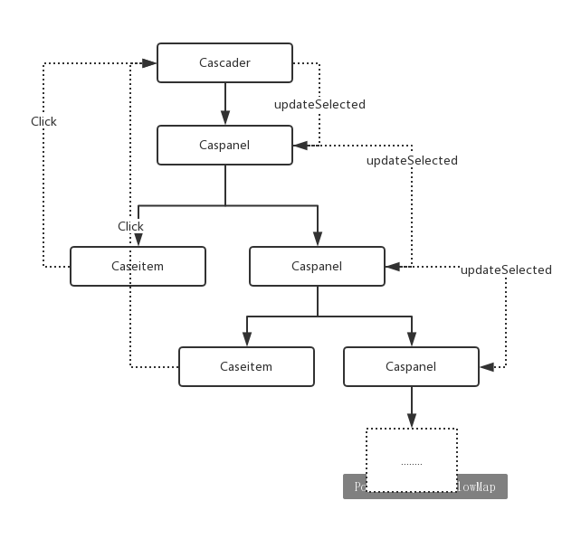

#   级联选择组件Cascader

    分享目的：剖析核心的功能，分析设计思路

    级联选择是网页应用中常见的表单类控件，主要用于省市区、公司级别、事务分类等关联数据集合的选择。

    文档地址：https://www.iviewui.com/components/cascader
    源码地址: https://github.com/iview/iview/tree/2.0/src/components/cascader

##  用法示例

Cascader 接收一个 prop: data 作为选择面板的数据源，使用v-model可以双向绑定当前选择的项

```html
<template>
    <Cascader :data="data" v-model="value"></Cascader>
</template>
<script>
export default {
    data () {
        return {
            value: ['guangdong','shenzhen','baoan'],
            data: [{
                value: "guangdong",
                label: "广东",
                children: [{
                    value: "shenzhen",
                    label: "深圳",
                    children: [{
                        value: "baoan",
                        label: "宝安区"
                    }]
                }]
            }]
        }
    }
}
```
data 中的 label 是面板显示的内容,value 是它对应的值,children 是它的子集，可递归 。 v-model绑定一个数组，每一项对应 data 里的value

##  组件API定义

开发一个通用组件最重要的是定义 APL Vue 组件的 API 来的部分：prop、slot 和 event。

API 决定了一个组件的所有功能，而且作为对外提供的组件，一旦 API 确定好后，如果再选代更新，用户的代价就会很高，因为他们已经在业务中使用你的组件，改动太多意味着所有用到的地方都需要改动，所以组件库更新分兼容更新和不兼容更新，不是迫不得已，最好后续的更新都是兼容性的，这对使用者会很友好。

##  prop
```
• data：决定了级联面板的内容。
• value：当前选择项，可使用 v-model.
• disabled：是否禁用．
• clearable：是否可清空。
• placeholder：占位提示 。
• size：尺寸（ iView 多数表单类组件都有尺寸） ．
• trigger：触发方式（点击或鼠标滑入） ．
• changeOnSelect：选择即改变 。
• renderFormat：自定义显示内容。
```

```javascript
// cascader.vue
<script>
export default {
    props: {
        data: {
            type: Array,
            default () {
                return []
            }
        },
        value: {
            type: Array,
            default () {
                return []
            }
        },
        disabled: {
            type: Boolean,
            default: false
        },
        clearable: {
            type: Boolean ,
            default: true
        },
        placeholder: {
            type: String ,
            default: '请选择'
        },
        size: {
            validator (value) {
                return oneOf(value,[’ small’,’ large ’ ])
            }
        },
        trigger: {
            validator (value) {
                return oneOf(value,[’ click’,’ hover ’]);
            },
            default: 'click'
        },
        changeOnSelect: {
            type: Boolean,
            default: false
        },
        renderFormat: {
            type: Function,
            default (label) {
                return label.join ( ' / ')
            }
        }
    }
}
</script>
```
Cascader 的核心是用到了组件递归,使用组件递归必不可少的两个条件是有 name 选项和在适当 的时候结束递归。

级联选择面板每一列都是一个组件 Caspanel (caspanel.vue),data 中的 children 决定了每项的子集，也就是需要递归显示Caspanel 的数量。

```javascript
// caspanel.vue
<template>
    <span>
        <ul v-if="data && data.length" :class="[prefixCls + '-menu']">
            <Casitem
                v-for="item in data"
                :key="item"
                :prefix-cls="prefixCls"
                :data="item"
                :tmp-item="tmpItem"
                @click.native.stop="handleClickItem(item)"
                @mouseenter.native.stop="handleHoverItem(item)"></Casitem>
        </ul><Caspanel v-if="sublist && sublist.length" :prefix-cls="prefixCls" :data="sublist" :disabled="disabled" :trigger="trigger" :change-on-select="changeOnSelect"></Caspanel>
    </span>
</template>
<script>
    import Casitem from './casitem.vue';
    export default {
        name: 'Caspanel',
        components: { Casitem },
        props: {
            data: {
                type: Array,
                default () {
                    return [];
                }
            },
            disabled: Boolean,
            changeOnSelect: Boolean,
            trigger: String,
            prefixCls: String
        },
        data () {
            return {
                tmpItem: {},
                result: [],
                sublist: []
            };
        },
        watch: {
            data () {
                this.sublist = [];
            }
        }
    }
</script>
```

当点击某一列的某一项时，会把它对应 data 的 children 数据赋给 sublist, sublist 会作为下一个
递归的 Caspanel 的 data 使用，以此类推。若该项没有 children，说明它是级联选择的最后一项，
则点击直接结束选择，同时结束 Caspanel 的递归。

最里层的组件是 Casitem， 就是每列的每项，它的作用就是把 data 或 children 的每个 label 显
示出来。

Caseader 的基本构成就是上述的 3 部分： cascader.vue 、 caspanel.vue 和 casitem.vue 。 cascader.vue
又分成两部分 ： 只读输入框（ Input）和下拉菜单（ Drop ） ， 在下拉菜单中使用第一个 Caspanel,
开始递归每一列。 cascader.vue 的 template 代码为：

```javascript
// cascader.vue
<template>
    <div :class="classes" v-click-outside="handleClose">
        <div :class="[prefixCls + '-rel']" @click="toggleOpen" ref="reference">
            <input type="hidden" :name="name" :value="currentValue">
            <slot>
                <i-input
                    :element-id="elementId"
                    ref="input"
                    :readonly="!filterable"
                    :disabled="disabled"
                    :value="displayInputRender"
                    @on-change="handleInput"
                    :size="size"
                    :placeholder="inputPlaceholder"></i-input>
                <div
                    :class="[prefixCls + '-label']"
                    v-show="filterable && query === ''"
                    @click="handleFocus">{{ displayRender }}</div>
                <Icon type="ios-close-circle" :class="[prefixCls + '-arrow']" v-show="showCloseIcon" @click.native.stop="clearSelect"></Icon>
                <Icon :type="arrowType" :custom="customArrowType" :size="arrowSize" :class="[prefixCls + '-arrow']"></Icon>
            </slot>
        </div>
        <transition name="transition-drop">
            <Drop
                v-show="visible"
                :class="{ [prefixCls + '-transfer']: transfer }"
                ref="drop"
                :data-transfer="transfer"
                :transfer="transfer"
                v-transfer-dom>
                <div>
                    <Caspanel
                        v-show="!filterable || (filterable && query === '')"
                        ref="caspanel"
                        :prefix-cls="prefixCls"
                        :data="data"
                        :disabled="disabled"
                        :change-on-select="changeOnSelect"
                        :trigger="trigger"></Caspanel>
                    <div :class="[prefixCls + '-dropdown']" v-show="filterable && query !== '' && querySelections.length">
                        <ul :class="[selectPrefixCls + '-dropdown-list']">
                            <li
                                :class="[selectPrefixCls + '-item', {
                                    [selectPrefixCls + '-item-disabled']: item.disabled
                                }]"
                                v-for="(item, index) in querySelections"
                                @click="handleSelectItem(index)" v-html="item.display"></li>
                        </ul>
                    </div>
                    <ul v-show="(filterable && query !== '' && !querySelections.length) || !data.length" :class="[prefixCls + '-not-found-tip']"><li>{{ localeNotFoundText }}</li></ul>
                </div>
            </Drop>
        </transition>
    </div>
</template>
<script>
    import iInput from '../input/input.vue';
    import Drop from '../select/dropdown.vue';
    import Icon from '../icon/icon.vue';
    import Caspanel from './caspanel.vue';
    import {directive as clickOutside} from 'v-click-outside-x';
    const prefixCls = 'ivu-cascader';
    const selectPrefixCls = 'ivu-select';
    export default {
        name: 'Cascader',
        mixins: [ Emitter, Locale ],
        components: { iInput, Drop, Icon, Caspanel },
        directives: { clickOutside, TransferDom },
        props: {
            // ...
        },
        data () {
            return {
                prefixCls: prefixCls,
                selectPrefixCls: selectPrefixCls,
                visible: false,
                selected: [],
                tmpSelected: [],
                updatingValue: false,    // to fix set value in changeOnSelect type
                currentValue: this.value,
                query: '',
                validDataStr: '',
                isLoadedChildren: false    // #950
            };
        },
        computed: {
            classes () {
                return [
                    `${prefixCls}`,
                    {
                        [`${prefixCls}-show-clear`]: this.showCloseIcon,
                        [`${prefixCls}-size-${this.size}`]: !!this.size,
                        [`${prefixCls}-visible`]: this.visible,
                        [`${prefixCls}-disabled`]: this.disabled,
                        [`${prefixCls}-not-found`]: this.filterable && this.query !== '' && !this.querySelections.length
                    }
                ];
            },
            showCloseIcon () {
                return this.currentValue && this.currentValue.length && this.clearable && !this.disabled;
            },
            displayRender () {
                let label = [];
                for (let i = 0; i < this.selected.length; i++) {
                    label.push(this.selected[i].label);
                }
                return this.renderFormat(label, this.selected);
            }
        }
    };
</script>
```

##  slot

Input ( i-input）组件崔默认的 slot 内， 这意味着你可以自定义触发器部分，不局限于使用输入
框，这让 Cascader 使用更灵活。使用 slot 时， 需要自己渲染显示的内容，所以提供了事件 on-change,
在选择完成时触发，返回 value 和 selectedData，分别为己选值和己选项的具体数据。示例代码如下 ：

```javascript
<template>
    {{text ))
    <Cascader :data="data" @on-change="handleChange">
        <a href="javascript: void(0)">选择</a>
    </Cascader>
</template>
<script>
export default{
    data () {
        return {
            text: '未选择',
            data : [
                //省略
            ],
            methods : {
                handleChange (val ue , selectedData ) {
                    this . text = selectedData .map (o => o.label ).join (’,’);
                }
            }
        }
    }
}
</script>
```

##  event


Cascader 各个组件之间的通信关系

在 Vue2 里 ， 组件间通信可以通过$emit、 bus、vuex来实现。但是iView作为独立组件，无法使用 bus 和 vuex，为了实现跨组件通信，iView 模拟了 Vue 1 的 dispatch 和 broadcast 方法。 

```javascript
// src/mixins/emitter.js
function broadcast(componentName, eventName, params) {
    this.$children.forEach(child => {
        const name = child.$options.name;

        if (name === componentName) {
            child.$emit.apply(child, [eventName].concat(params));
        } else {
            // todo 如果 params 是空数组，接收到的会是 undefined
            broadcast.apply(child, [componentName, eventName].concat([params]));
        }
    });
}
export default {
    methods: {
        dispatch(componentName, eventName, params) {
            let parent = this.$parent || this.$root;
            let name = parent.$options.name;

            while (parent && (!name || name !== componentName)) {
                parent = parent.$parent;

                if (parent) {
                    name = parent.$options.name;
                }
            }
            if (parent) {
                parent.$emit.apply(parent, [eventName].concat(params));
            }
        },
        broadcast(componentName, eventName, params) {
            broadcast.call(this, componentName, eventName, params);
        }
    }
};
```

emitter.js使用递归向上或向下的方式查找指定的组件名称（ name ），找到后触发$emit 。有了 emitter.js就可以自由的跨组件通信了。

在初始化时（ mounted ) , Cascader 需要判断是否已经设置了选中值，若设置了，则所有的 Caspanel 和 Casitern 更新选中状态。这个过程是在Cascader 使用 broadcast 通知 Caspanel ，然后递归通知附属的 Caspanel同理，当从父组件修改 value时，也执行检查（即updateSelected 方法）。在点击 Casitern 时，使用 dispatch 通知Cascader 来更新在输入框中的选中值 ， 这样基本就形成了一个闭环。


通信相关的代码：

```javascript
// cascader.vue
<script>
import Emitter from '../../mixins/emitter';
export default {
    mixins: [ Emitter ],
    methods: {
        updateSelected (init = false, changeOnSelectDataChange = false) {
            // #2793 changeOnSelectDataChange used for changeOnSelect when data changed and set value
            if (!this.changeOnSelect || init || changeOnSelectDataChange) {
                this.broadcast('Caspanel', 'on-find-selected', {
                    value: this.currentValue
                });
            }
        },
        emitValue (val, oldVal) {
            if (JSON.stringify(val) !== oldVal) {
                this.$emit('on-change', this.currentValue, JSON.parse(JSON.stringify(this.selected)));
                this.$nextTick(() => {
                    this.dispatch('FormItem', 'on-form-change', {
                        value: this.currentValue,
                        selected: JSON.parse(JSON.stringify(this.selected))
                    });
                });
            }
        }
    },
    created () {
        this.validDataStr = JSON.stringify(this.getValidData(this.data));
        this.$on('on-result-change', (params) => {
            // lastValue: is click the final val
            // fromInit: is this emit from update value
            const lastValue = params.lastValue;
            const changeOnSelect = params.changeOnSelect;
            const fromInit = params.fromInit;
            if (lastValue || changeOnSelect) {
                const oldVal = JSON.stringify(this.currentValue);
                this.selected = this.tmpSelected;
                let newVal = [];
                this.selected.forEach((item) => {
                    newVal.push(item.value);
                });
                if (!fromInit) {
                    this.updatingValue = true;
                    this.currentValue = newVal;
                    this.emitValue(this.currentValue, oldVal);
                }
            }
            if (lastValue && !fromInit) {
                this.handleClose();
            }
        });
    },
    mounted () {
        this.updateSelected(true);
    },
    watch: {
        visible (val) {
            if (val) {
                if (this.currentValue.length) {
                    this.updateSelected();
                }
                if (this.transfer) {
                    this.$refs.drop.update();
                }
                this.broadcast('Drop', 'on-update-popper');
            } else {
                if (this.filterable) {
                    this.query = '';
                    this.$refs.input.currentValue = '';
                }
                if (this.transfer) {
                    this.$refs.drop.destroy();
                }
                this.broadcast('Drop', 'on-destroy-popper');
            }
            this.$emit('on-visible-change', val);
        },
        value (val) {
            this.currentValue = val;
            if (!val.length) this.selected = [];
        },
        currentValue () {
            this.$emit('input', this.currentValue);
            if (this.updatingValue) {
                this.updatingValue = false;
                return;
            }
            this.updateSelected(true);
        },
        data: {
            deep: true,
            handler () {
                const validDataStr = JSON.stringify(this.getValidData(this.data));
                if (validDataStr !== this.validDataStr) {
                    this.validDataStr = validDataStr;
                    if (!this.isLoadedChildren) {
                        this.$nextTick(() => this.updateSelected(false, this.changeOnSelect));
                    }
                    this.isLoadedChildren = false;
                }
            }
        }
    }
};
</script>
```

```javascript
// caspanel.vue
<script>
import Emitter from '../../mixins/emitter';
export default {
    mixins: [ Emitter ],
    methods: {
        handleClickItem (item) {
            if (this.trigger !== 'click' && item.children && item.children.length) return;  // #1922
            this.handleTriggerItem(item, false, true);
        },
        handleHoverItem (item) {
            if (this.trigger !== 'hover' || !item.children || !item.children.length) return;  // #1922
            this.handleTriggerItem(item, false, true);
        },
        handleTriggerItem (item, fromInit = false, fromUser = false) {
            if (item.disabled) return;
            const cascader = findComponentUpward(this, 'Cascader');
            if (item.loading !== undefined && !item.children.length) {
                if (cascader && cascader.loadData) {
                    cascader.loadData(item, () => {
                        // todo
                        if (fromUser) {
                            cascader.isLoadedChildren = true;
                        }
                        if (item.children.length) {
                            this.handleTriggerItem(item);
                        }
                    });
                    return;
                }
            }
            // return value back recursion  // 向上递归，设置临时选中值（并非真实选中）
            const backItem = this.getBaseItem(item);
            // #5021 for this.changeOnSelect，加 if 是因为 #4472
            if (
                this.changeOnSelect ||
                (backItem.label !== this.tmpItem.label || backItem.value !== this.tmpItem.value) ||
                (backItem.label === this.tmpItem.label && backItem.value === this.tmpItem.value)
            ) {
                this.tmpItem = backItem;
                this.emitUpdate([backItem]);
            }
            if (item.children && item.children.length){
                this.sublist = item.children;
                this.dispatch('Cascader', 'on-result-change', {
                    lastValue: false,
                    changeOnSelect: this.changeOnSelect,
                    fromInit: fromInit
                });
                // #1553
                if (this.changeOnSelect) {
                    const Caspanel = findComponentDownward(this, 'Caspanel');
                    if (Caspanel) {
                        Caspanel.$emit('on-clear', true);
                    }
                }
            } else {
                this.sublist = [];
                this.dispatch('Cascader', 'on-result-change', {
                    lastValue: true,
                    changeOnSelect: this.changeOnSelect,
                    fromInit: fromInit
                });
            }
            if (cascader) {
                cascader.$refs.drop.update();
            }
        },
        updateResult (item) {
            this.result = [this.tmpItem].concat(item);
            this.emitUpdate(this.result);
        },
        getBaseItem (item) {
            let backItem = Object.assign({}, item);
            if (backItem.children) {
                delete backItem.children;
            }
            return backItem;
        },
        emitUpdate (result) {
            if (this.$parent.$options.name === 'Caspanel') {
                this.$parent.updateResult(result);
            } else {
                this.$parent.$parent.updateResult(result);
            }
        }
    },
    mounted () {
        // 接收来自 Cascader 和 Caspanel 的更新选中值事件
        this.$on('on-find-selected', (params) => {
            const val = params.value;
            let value = [...val];
            for (let i = 0; i < value.length; i++) {
                for (let j = 0; j < this.data.length; j++) {
                    if (value[i] === this.data[j].value) {
                        this.handleTriggerItem(this.data[j], true);
                        value.splice(0, 1);
                        this.$nextTick(() => {
                            this.broadcast('Caspanel', 'on-find-selected', {
                                value: value
                            });
                        });
                        return false;
                    }
                }
            }
        });
        // deep for #1553
        this.$on('on-clear', (deep = false) => {
            this.sublist = [];
            this.tmpItem = {};
            if (deep) {
                const Caspanel = findComponentDownward(this, 'Caspanel');
                if (Caspanel) {
                    Caspanel.$emit('on-clear', true);
                }
            }
        });
    }
};
</script>
```

独立组件与业务组件最大的不同是，业务组件往往针对数据的获取、整理、可视化，逻辑清晰简单，可以使用vuex：而独立组件的复杂度更多集中在细节、交互、性能优化、API设计上，对原生 JavaScript 有一定考验。

在使用过程中，可能会有新功能的不断添加，也会发现隐藏的 bug,所以独立组件一开始逻辑和代码量并不复杂，多次选代后会越来越冗长，当然功能也更丰富，使用更稳定。

万事开头难，组件 API 的设计和可扩展性决定了组件迭代的复杂性。一开始不可能考虑到所有的细节，但是整体架构要清晰可扩展，否则很有可能重构。